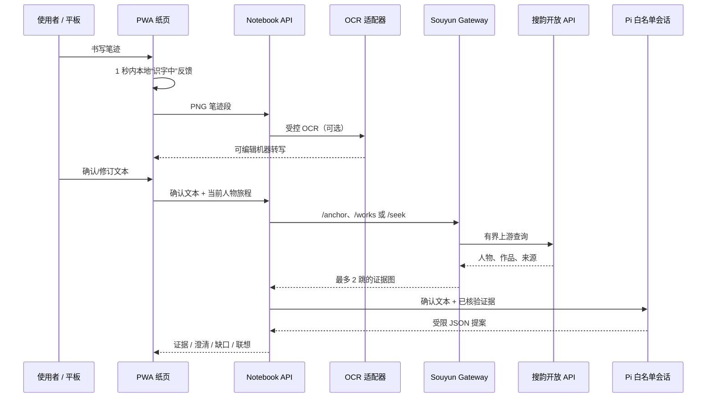

# 操作与架构指南

这份指南面向日常开发、演示与受控真实服务验证。它描述的是当前仓库的实际边界：纸页由 PWA 承担，识别、图谱、Pi 与凭据全部留在服务端。

## 1. 先理解运行边界



关键规则：

- 原始笔迹由浏览器保存，不能被 OCR 或模型文本覆盖。
- 视觉识别的结果必须由用户确认；Pi 从不接收笔迹 PNG。
- 浏览器没有模型、OCR、gateway 或上游 API 凭据。
- 证据旁批只能来自来源、节点、边均通过核验的有界图；文化补充必须以“联想：”标出。
- 静读模式只存笔迹；切换静读、翻页、续页、清空或重新落笔会取消未完成请求。

## 2. 仓库结构与职责

| 位置 | 职责 | 何时需要关注 |
| --- | --- | --- |
| `src/main.tsx` | 纸页 UI、手写、旅程状态和 API 调用 | 调整交互或排版 |
| `src/notebook-store.ts` | 本地页面、笔迹和旁批持久化 | 检查翻页、续页、恢复 |
| `server/notebook-server.mjs` | `/api/transcribe`、`/api/seek`、`/api/narrative` 的受控边界 | API 故障或独立部署 |
| `server/transcription-adapter.mjs` | OCR provider 选择、超时与安全降级 | 接入/评测 OCR |
| `server/journey-agent.mjs` | 人物锚点、路线归一化、作品候选、联想编排 | 人物旅程行为 |
| `server/run-seek.mjs` | Pi 调用、请求内检索缓存、确定性降级 | 证据旁批输出 |
| `server/cnkgraph-gateway.mjs` | notebook 对 gateway 的认证、有界化与响应校验 | gateway 接入 |
| `server/souyun-gateway-service.mjs` | `/anchor`、`/works`、`/seek` 与搜韵 API 转换 | 真实知识库服务 |
| `docs/*-contract.md` | 产品、Pi、gateway 的不可突破边界 | 修改接口或工具面之前 |

正常开发时，Vite 已通过 `vite.config.ts` 装载 Notebook API middleware；不需要额外启动 `npm run serve:api`。后者只用于把 API 单独作为 HTTP 服务部署或集成测试。

## 3. 环境准备

需要安装当前 Node LTS 和 npm。首次运行：

```bash
npm install
cp .env.example .env
```

`.env` 只保存在本机，已被 Git 忽略。不要把 token、API key、OCR 样本、真实响应日志写入仓库。

### 3.1 最小纸页模式

不填任何凭据也可以启动和检查纸页：

```bash
npm run dev -- --host 0.0.0.0
```

此模式可书写、翻页和安装 PWA。没有 OCR 时，停笔后会出现空的可编辑转写框；没有图谱或 Pi 时，寻迹会明确提示服务未配置，而不会伪造旁批。

### 3.2 离线夹具模式

用于稳定演练三种结果，不访问模型或网络：

```bash
NOTEBOOK_FIXTURE_MODE=1 npm run dev -- --host 0.0.0.0
```

夹具会清晰显示“演练转写（未调用视觉模型）”。可打开下列路径：

- `/?demo=evidence`：有来源的证据旁批。
- `/?demo=ambiguous`：实体歧义与候选。
- `/?demo=gap`：证据缺口与“联想：”标签。
- `/?demo=journey`：固定人物路线演练。

不要把夹具输出描述成真实 OCR、Pi 或知识库结果。

### 3.3 本机真实搜韵 gateway

在 `.env` 中为本机开发填入同一份 **仅本机使用** 的 gateway token。下面所有值都是示例占位符，不能原样用于共享环境：

```dotenv
# 使用 gateway 时保持 CNKGRAPH_PROVIDER 为空；设置 souyun-snapshot 会改走本地快照。
CNKGRAPH_PROVIDER=

SOUYUN_GATEWAY_AUTH_TOKEN=replace-with-a-local-random-token
SOUYUN_GATEWAY_PORT=8787
CNKGRAPH_GATEWAY_ENDPOINT=http://127.0.0.1:8787/seek
CNKGRAPH_GATEWAY_AUTH_TOKEN=replace-with-the-same-local-random-token

# 只允许本机 HTTP 开发预检；部署时删除该项并使用 HTTPS endpoint。
SOUYUN_PREFLIGHT_ALLOW_HTTP=1
```

另开一个终端启动 gateway：

```bash
npm run serve:souyun-gateway
```

启动成功后，运行受控真实探针：

```bash
npm run preflight:souyun-gateway
```

该预检会检查健康端点、拒绝错误 token、标准证据问句与明确缺口问句；它会访问当前配置的 gateway 及其上游。生产环境必须将 gateway 放在 HTTPS 之后，并移除 `SOUYUN_PREFLIGHT_ALLOW_HTTP`。

### 3.4 Pi 与 OCR

PWA 的真实证据链需要已配置的 Pi 模型和 gateway。OCR 是可选的：未配置时，用户可在纸上手动确认转写。

在 `.env` 填入实际 provider 所需的非敏感名称与只在服务端使用的认证变量。DeepSeek 视觉模型已作为明确 provider 接入，复用已有的 `DEEPSEEK_API_KEY`，不需要把同一密钥复制到 `VISION_VLM_API_KEY`：

```dotenv
PI_MODEL_PROVIDER=<provider>
PI_MODEL_ID=<model-id>
# provider 对应的认证变量，例如 DEEPSEEK_API_KEY，只保存在 .env。

# OCR 可选；DeepSeek 视觉转写使用官方 OpenAI 兼容图片接口。
VISION_MODEL_PROVIDER=deepseek-vision
VISION_MODEL_ID=deepseek-v4-flash-vision-exp
```

先执行静态预检：

```bash
npm run preflight:pi
npm run preflight:services
```

这两条命令只检查配置是否存在、模型 ID 是否可识别以及 endpoint 协议是否合法；不会打印凭据，也不会发起模型调用。完整变量解释见 [`.env.example`](../.env.example) 和 [Pi 工具合同](pi-tool-contract.md)。

DeepSeek 官方说明该实验模型接受 PNG Base64 `image_url`，这正是当前服务端适配器的请求形状。模型输出仍只作为可编辑转写，不能直接成为寻迹事实；应当用经明确同意的同一批手写样本与其他 provider 做 CER、可用率、确认修改率和延迟对照后，再决定是否保留为默认 OCR。

### 3.5 启动顺序

真实寻迹的推荐顺序：

```text
终端 A  npm run serve:souyun-gateway
终端 B  npm run preflight:souyun-gateway
终端 C  npm run dev -- --host 0.0.0.0
```

`npm run dev` 已同时提供前端和 Notebook API middleware。只有在独立部署 API 时才使用：

```bash
PORT=4174 npm run serve:api
```

## 4. PWA 操作流程

### 人物 → 路线 → 证据

1. 保持页面在“寻迹”模式，写下人物名，例如“白居易”。
2. 停笔后先确认本地“识字中”，再在纸面确认或修订转写，点击“以此寻迹”。
3. 人物档案出现在右侧“纸上旁批”栏。选择“地点”“经历”或“作品”。
4. 按线索提示继续写：地点路线可写地名；作品路线可写“代表作”或“写过什么”。
5. 若出现作品候选，点选某一件作品，再查看 `人物 → 关系 → 作品`、时间线和来源。
6. 点按证据旁批展开“寻迹卡”；来源链接和路径必须都存在，才可视为事实性回应。
7. 第四条路线证据后可“收纳这条路线”；印章可再次点开恢复内容。

可复测的真实知识库路径：`白居易` → 选择“作品” → 写“代表作” → 选择《招王质夫》。若当前上游可用，应出现“白居易 → 作者 → 招王质夫”、806 年和来源链接。

### 页面与人物管理

- “新页/续页”：创建新纸页；有旅程时会继承已核验的最近路线历史。
- “换人物”：必须先点按，再确认新人物名；短地点或作品词不会静默替换当前锚点。
- “清空”：只清空当前页的笔迹、转写、旁批和人物旅程，需二次确认，不影响其他页。
- “静读”：只记录笔迹，不请求 OCR、Pi 或图谱。

### 华为平板安装与验收

1. 让平板与开发机处于同一网络，打开 `http://<开发机局域网-IP>:5173/`。
2. 浏览器菜单选择“添加到主屏幕”。PWA 壳会缓存页面基础资源；真实 OCR、Pi 和图谱仍需服务端可用。
3. 横屏与竖屏各测试一次；触控笔与手指各写一次。
4. 确认书写时浏览器不会抢走滚动手势、停笔后本地反馈不等待网络、静读模式不出现寻迹旁批。

## 5. 知识库 API 的服务端探针

这些是 gateway 的运维/开发接口，不应由浏览器直接调用。先在安全的本机 shell 中加载 `.env`，再使用其中的 token；命令不会输出 token。

```bash
# 健康检查：不需要认证
curl -s http://127.0.0.1:8787/healthz

# 人物档案
curl -s http://127.0.0.1:8787/anchor \
  -H 'Content-Type: application/json' \
  -H "Authorization: Bearer ${SOUYUN_GATEWAY_AUTH_TOKEN}" \
  --data '{"person":"白居易"}'

# 有界作品候选
curl -s http://127.0.0.1:8787/works \
  -H 'Content-Type: application/json' \
  -H "Authorization: Bearer ${SOUYUN_GATEWAY_AUTH_TOKEN}" \
  --data '{"person":"白居易"}'

# 有界证据图：最多 2 跳、8 节点、8 边、4 个来源
curl -s http://127.0.0.1:8787/seek \
  -H 'Content-Type: application/json' \
  -H "Authorization: Bearer ${SOUYUN_GATEWAY_AUTH_TOKEN}" \
  --data '{"query":"白居易写过《招王质夫》吗","limits":{"maxHops":2,"maxNodes":8,"maxEdges":8,"maxSources":4}}'
```

预期不是上游原始响应，而是内部归一结果：

| 路径 | 成功形状 | 用途 |
| --- | --- | --- |
| `GET /healthz` | `{ "status": "ok" }` | 存活检查 |
| `POST /anchor` | `person_anchor` / `person_ambiguous` / `evidence_gap` | 人物锚点与档案 |
| `POST /works` | `works` / `person_ambiguous` / `evidence_gap` | 有界作品候选 |
| `POST /seek` | `evidence` / `evidence_gap` | 来源、路径和时空索引 |

Notebook API 只有三个内部端点：`POST /api/transcribe`、`POST /api/seek`、`POST /api/narrative`。前端只通过同源路径调用它们；独立 API 服务的默认端口为 4174。

## 6. 常见状态与排障

| 页面/接口状态 | 含义 | 处理方式 |
| --- | --- | --- |
| `vision_unconfigured` | 没有可用 OCR | 在纸面手动补写，或按 `.env.example` 配置一个 OCR provider |
| `graph_unconfigured` | gateway endpoint/token 缺失或快照不存在 | 检查 `CNKGRAPH_*`，再运行 `npm run preflight:services` |
| `graph_timed_out` | gateway 或上游超过 8 秒 | 查看 gateway 进程和网络，稍后重试；不要把它视为“没有证据” |
| `graph_unavailable` | 鉴权、限流、网络、上游格式等服务故障 | 先运行 `npm run preflight:souyun-gateway`；确认错误 token 会被拒绝 |
| `model_unconfigured` | Pi 模型未配置 | 设置 `PI_MODEL_PROVIDER`、`PI_MODEL_ID` 和对应服务端认证，再运行 `npm run preflight:pi` |
| 证据缺口 | 上游明确没有可核验的路径，或来源/边校验失败 | 补充人物、作品、地点或时间词；不能用模型文字替代来源 |
| 多人物候选 | 同名人物无法唯一确认 | 点选或写“朝代·姓名”，不要直接猜测 |

如果页面状态与预期不一致，先在浏览器中清空当前页或新建一页，避免旧笔迹和旅程上下文混入排查。不要通过清空浏览器存储来绕过产品状态机。

## 7. 验证矩阵

| 目标 | 命令 | 是否访问网络 |
| --- | --- | --- |
| TypeScript | `npm run check` | 否 |
| 生产构建 | `npm run build` | 否 |
| Pi / Notebook 服务端合同 | `npm run check:agent` | 否 |
| 人物锚点、路线、候选 | `npm run check:journey-agent` | 否 |
| 搜韵 gateway 协议 | `npm run check:souyun-gateway` | 否（使用受控 fake upstream） |
| 真实服务静态就绪 | `npm run preflight:services` | 否 |
| 真实 gateway 探针 | `npm run preflight:souyun-gateway` | 是 |
| PWA 壳合同 | `node server/check-pwa-shell.mjs` | 否 |

涉及纸页交互的改动，除自动检查外还要按第 4 节进行平板横竖屏、触控笔和手指的人工验收。详见 [MVP 合同](mvp-contract.md)。

## 8. 部署底线

- gateway 必须在 HTTPS 之后部署，且只接受服务端 Bearer token；不要把 `SOUYUN_PREFLIGHT_ALLOW_HTTP=1` 带到生产。
- gateway 对外只接收确认后的短文本或实体，不接收 PNG、笔迹历史、Pi prompt 或客户端标识。
- 单次图谱查询限制为最多 2 跳、8 节点、8 边、4 个来源；不做分页或自由扩展。
- 上游条款、缓存期限和来源展示规则必须在部署前复核；具体内部合同见 [搜韵 CNKGraph Gateway 合同](souyun-cnkgraph-gateway-contract.md)。
- 任何模型失败都不能让未核验文本冒充事实；证据先于联想，来源先于措辞。
